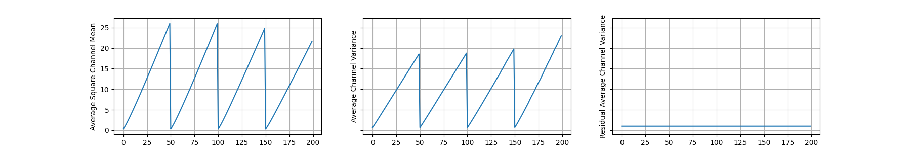
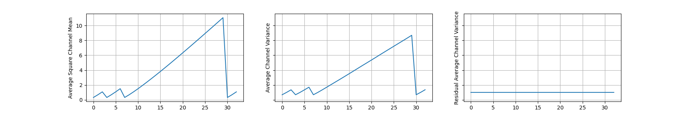
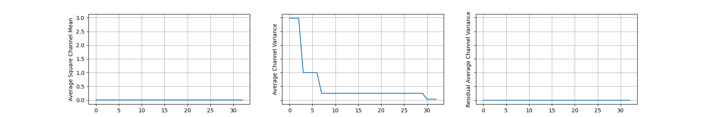

# Signal Propagation Plots

> Example results of SPPs

## 1. Signal Propagation Plots

I referred to the [@amaarora's](https://gist.github.com/amaarora) [code](https://gist.github.com/amaarora/2c6199c3441c0d72f356f39fb9f59611).

### ResNet-V2-600



### ResNet101



### NF-ResNet101



## 2. Signal Propagation Videos

In original paper, SPPs are checked only during the model initialization phase. I wondered how SPPs change not only in model initialization but also during the training phase. Therefore, during training, the signal propagation values were saved in the logger, and after training the model, all SPPs were collected so that they could be checked in the form of a video. Below are the video results of SPPs which trained about cifar100 dataset using the ResNet-V2-600 model.

- TBU

## References

Signal Propagation Plots

```
@article{brock2021high,
  author={Andrew Brock and Soham De and Samuel L. Smith and Karen Simonyan},
  title={High-Performance Large-Scale Image Recognition Without Normalization},
  journal={arXiv preprint arXiv:},
  year={2021}
}
```

I used NF-ResNets implemented by [Ross Wightman](https://github.com/rwightman) from [timm](https://github.com/rwightman/pytorch-image-models/blob/master/timm/models/nfnet.py).

```
@misc{rw2019timm,
  author = {Ross Wightman},
  title = {PyTorch Image Models},
  year = {2019},
  publisher = {GitHub},
  journal = {GitHub repository},
  doi = {10.5281/zenodo.4414861},
  howpublished = {\url{https://github.com/rwightman/pytorch-image-models}}
}
```
