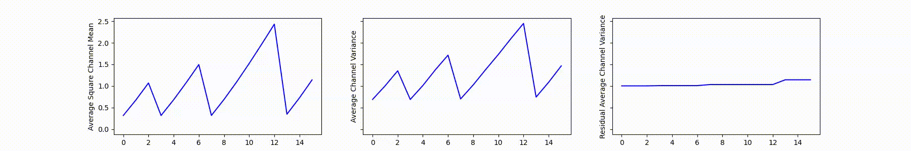
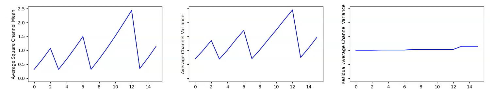

# Signal Propagation Plots

> Example results of SPPs (Brock et al., 2021)

## 1. Signal Propagation Plots

I referred to [@amaarora's](https://gist.github.com/amaarora) [code](https://gist.github.com/amaarora/2c6199c3441c0d72f356f39fb9f59611).

### ResNet-V2-600

### ResNet101

## 2. Signal Propagation Videos

The original paper checks SPPs only during the model initialization phase. I wondered how SPPs change not only in model initialization but also during the training phase.

Therefore, I saved the signal propagation values in the logger during training. After the model training, I collected all SPPs so they could be checked in the form of a video. Below is the video result of SPPs when the model was trained on the CIFAR-100 dataset. You can find the detailed codes in `spp.py` and `train_cifar.py`.

The type of input for each epoch is Gaussian noise. In the above video, the "residual average channel variation" is close to 1 at the beginning. However, as the learning progresses, this value approaches zero. Therefore, you can see that the "average channel variance" value also stays close to zero. (Below is a picture of the start point of training)

## References

- Brock, Andrew, Soham De, and Samuel L. Smith. "Characterizing signal propagation to close the performance gap in unnormalized ResNets." ICLR 2021.
- Brock, Andy, et al. "High-performance large-scale image recognition without normalization." *International Conference on Machine Learning*. PMLR, 2021.

---

[Here](https://github.com/rwightman/pytorch-image-models/blob/master/timm/models/nfnet.py) is a good reference code for NFnet. I also checked the NF net SPP results, but they differed from the original paper. I thought it was my implementation error and couldn't find the cause of the error, so I didn't include it in this repository.
