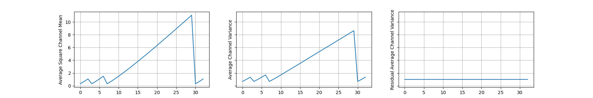

# Signal Propagation Plots

> Example results of SPPs (Brock et al., 2021)

## 1. Signal Propagation Plots

I referred to the [@amaarora's](https://gist.github.com/amaarora) [code](https://gist.github.com/amaarora/2c6199c3441c0d72f356f39fb9f59611).

### ResNet-V2-600

### ResNet101

## 2. Signal Propagation Videos

In original paper, SPPs are checked only during the model initialization phase. I wondered how SPPs change not only in model initialization but also during the training phase. 

Therefore, during training, the signal propagation values were saved in the logger, and after training the model, all SPPs were collected so that they could be checked in the form of a video. Below are the video result of SPPs which trained about cifar100 dataset using ResNet-50 model. You can find the detailed codes at `spp.py` and `train_cifar.py`.

Gaussian noise was input for each epoch, and input batch statistics were used in BN because training mode was used. In the above video, it is too short to be seen, "residual average channel variation" was close to 1 in the beginning. However, as the learning progresses, this value approaches zero. Therefore, you can see that the "average channel variance" value also stays close to zero. (Below is a picture of the start point of training)

## References

- Brock, Andrew, Soham De, and Samuel L. Smith. "Characterizing signal propagation to close the performance gap in unnormalized ResNets." ICLR 2021.
- Brock, Andy, et al. "High-performance large-scale image recognition without normalization." *International Conference on Machine Learning*. PMLR, 2021.

---

[Here](https://github.com/rwightman/pytorch-image-models/blob/master/timm/models/nfnet.py) is a good reference code for NFnet. I also checked the SPP results for NF net, but it was different from the original paper. I thought it was my implementation error, but I didn't include it in this repository because I couldn't find the cause of error.
