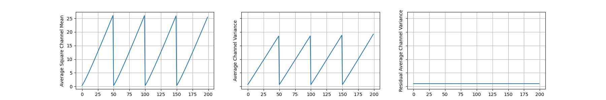

# Signal Propagation Plots

## Features

### 1. Signal Propagation Plots

ResNet-V2-600



ResNet152


NF-ResNet152

- TBU

### 2. Signal Propagation Videos

Cifar100 training with ResNet-V2-600

- TBU

### 3. NF-ResNets w/ PyTorch

There are NF-ResNets files in the `models` directory.

- I added Beta update codes in [vballoli's codes](https://github.com/vballoli/nfnets-pytorch) for a more accurate reproduction of the original paper.
- I added ResNet variants(e.g. ResNet32) which are composed of 3 stages and only use BasicBlock. Original ResNet architectures are composed of 4 stages and use BasicBlock or Bottleneck.


## How to Use?

- TBU

## References

Signal Propagation Plots

```
@article{brock2021high,
  author={Andrew Brock and Soham De and Samuel L. Smith and Karen Simonyan},
  title={High-Performance Large-Scale Image Recognition Without Normalization},
  journal={arXiv preprint arXiv:},
  year={2021}
}
```

NF-ResNets w/ PyTorch

```
@misc{nfnets2021pytorch,
  author = {Vaibhav Balloli},
  title = {A PyTorch implementation of NFNets and Adaptive Gradient Clipping},
  year = {2021},
  howpublished = {\url{https://github.com/vballoli/nfnets-pytorch}}
}
```